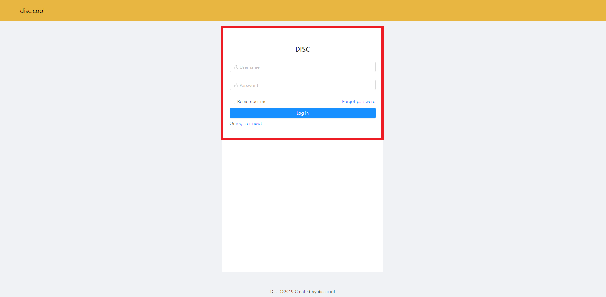
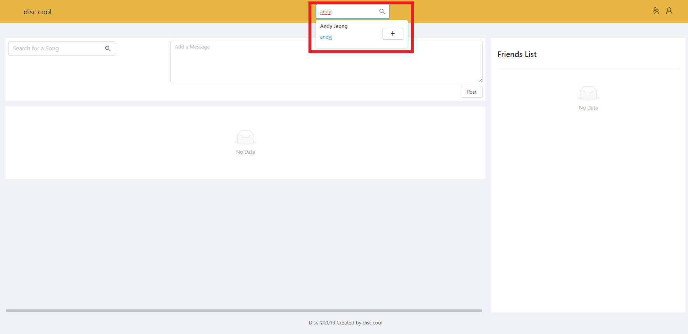
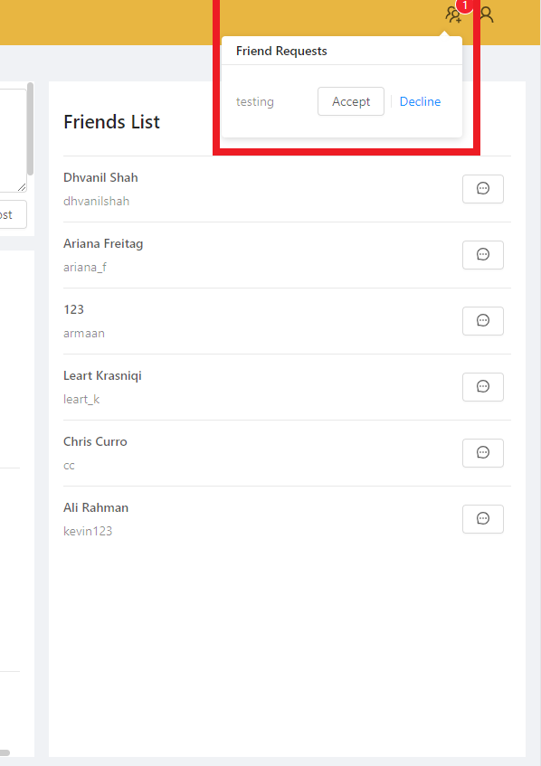
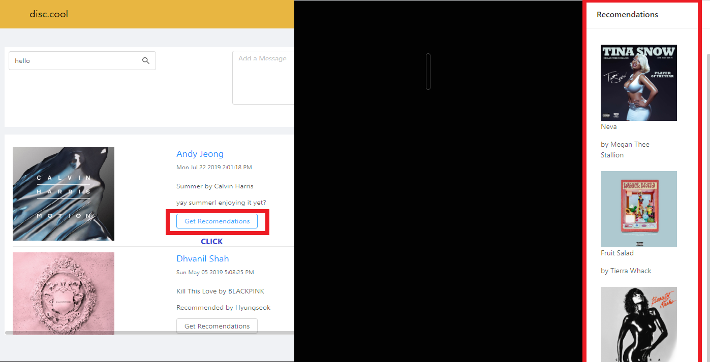
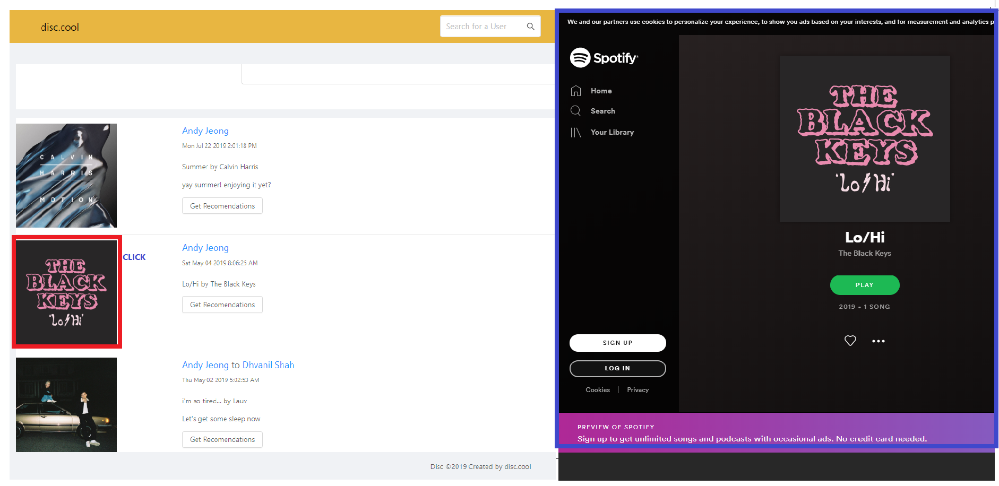

### Symmetric Social Network Service Platform: Disc.cool
- Contributors: Ariana Freitag, Andy Jeong, Leart Krasniqi, and Dhvanil Shah

#### Project Description
- Symmetric Social Network Service Platform designed to provide a medium through which songs could be shared across public/ connected users.
- Track/album/artist access(fetching) will be possible through open-source song service APIs (currently only Spotify)
- Language: Java, JavaScript
- Tools: Maven

#### Tech Stack
- ReactJS, Redux, Axios
- Nginx, Apollo-Spotify, MongoDB

#### Build with Maven
```bash
mvn clean compile   // compiles the project
mvn package         // compile, run tests, and produce deployable artifact (fat .jar)
java -jar ${path for fat Jar file} App -Dhttp.server.port=${port} // specify path and port address
// by default, the bankend server will run on localhost with above command
```
*******
#### Overview of Service
- Token-based persistent login (entry-point)


- Search for a song, and add a post with message

- Search for a user

- Send Friend Request

- Receive Friend Request

- Retrieve recommendation from the song in a post

- Click on album cover to link to Spotify song page

- View friend's profile by clicking friend's username, or your own by clicking the user icon


********
##### Explanation of FrontEnd
The front end consists of components that can be reused on different pages. Right now we have a home page, sign in page, and sign up page.  

We are currently using the front end locally. To run the front end first, install package `yarn`.
Once yarn is installed, cd into the front end repository. Run `yarn start` in the terminal window.
By default, the app will run on localhost:3000.

```
brew [apt-get] install yarn 
cd ${directory}
yarn start
```
********
##### Explanation of Web Server (Nginx)
- In our project, we are using Nginx both as a server for our static HTML files, as well as a reverse proxy for our Apollo server. The server is configured to listen on port 8000 and acts as a reverse proxy to `localhost:8080`, which is where the Apollo server is listening.  

- The static files can be found in */var/www/disc.cool* and are referred to by the `root` directive in the actual Nginx code.  The Nginx code can be found in */etc/nginx/sites-enabled/disc.cool* and the configuration file, which includes all code in the */etc/nginx/sites-enabled/* directory can be found in */etc/nginx/nginx.conf*.  

- In order to run Nginx, run the following command: `sudo nginx` and in order to stop Nginx, run: `sudo nginx -s stop`.  A very helpful guide for running Nginx on an Ubuntu VM can be found [here](https://medium.com/@jgefroh/a-guide-to-using-nginx-for-static-websites-d96a9d034940?fbclid=IwAR2HYBfjMCbsoSDHM9SHxzrMWqOVn5nwLl1OegxakSP9Sp2OR5fa6gj9msw).

Below is our actual code in the file */etc/nginx/sites-enabled/disc.cool*:
```
server {
  listen 8000 default_server;
  listen [::]:8000 default_server;
  root /var/www/disc.cool/;
  index index.html;
  server_name disc.cool www.disc.cool;
  location ~ ^/api/(.*)$  {
	# insert Apollo IP address and server port number below
    	proxy_pass http://199.98.27.115:8080/$1;
  }
}
```
The `location` directive tells Nginx to reverse proxy whenever a URI contains */api/* and pass whatever argument follows the */api/* segment to the Apollo server listening on port 8080.

********
##### Explanation of BackEnd Server
In general, the flow of the process is as such:
App -> Handler routes -> Controller implementation. Upon start, ```HttpService.boot()```, followed by ```init()```, is called, where path routes from the Handlers are registered: ```registerRoutes( Handler.routes()```. Then each path route is asynchronously linked to the specified uri and its method type (i.e. GET, POST).

To check what parameters are needed for a user, post, etc., check under ```/model``` directory

User currently has the following endpoints (subject to change):
  1) ```/addUser``` : adds a user with the provided input payload.

  2) ```/getUser/${name}``` : returns a user with the specified ${name}

Post currently has the following endpoints (subject to change):
  1) ```/getFeed?name=${name}``` : when name equals the {first+last name concatenated} of an existing user, it returns all posts written by the identified user and his/her friends. This uses methods ``` getPosts``` on each friend of the user (```getFriends ```) and the user as well, and returns a list of Posts.

  2) ```/addPost``` : given writer, targeted user and message, it adds a post entry to the collection in the database. The input payload will be passed in as a JSON object (``` payload()```).

  3) ```/getAllPosts``` : retrieves all posts in the post collection.

Track currently has the following endpoints (subject to change):
  1) ```/song/${title}``` : upon calling this endpoint with the title as the argument, it searches for a song on Spotify Web API and returns the first (most relevant) openspotify url. Then it stores in our "searched song" collection database
  
  2) ```/song/add``` : takes in a JSON formatted data (payload) and returns a HTTP response according to the status of the insertion to collection
  
  3) ```/song/recommend/${title}``` : by the user's query (title), it searches for a recommended song, using the seeded artist, album, track. 
  
 Friend currently has the following endpoints (subject to change):
  1) ```/addFriend/${id}``` : takes in a userId from the front end and sends that friend a request
    
  2) ```/handleRequest/${id}/${action}``` : takes in a userId from a friend request and and action (either "decline" or "accept") and handles the request
